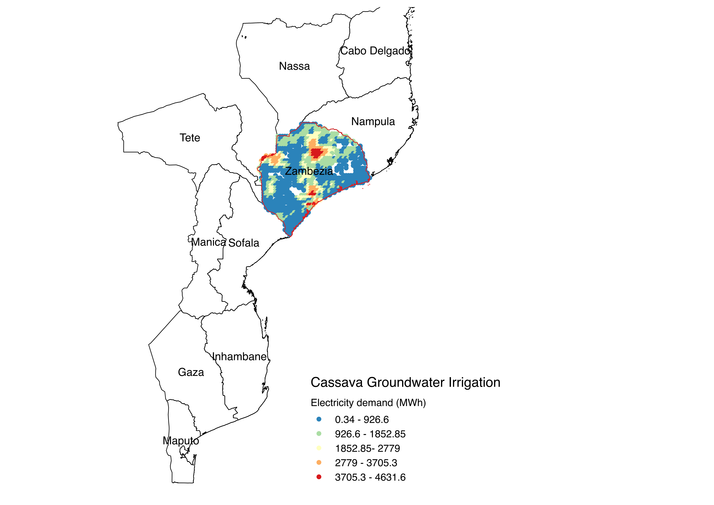

# agrodem_pilot

Documentation: To be updated

**agrodem** provides an estimate of water and electricity demand for ground water irrigation.
The following example studies the case of cassava in the Zambezia province in Mozambique.
**Note!** input data are not representative and results are only indicative.

Visualized in QGIS, sample results look like this:



## Input requirements
- Pilot_Input_Crop_Cassava.csv 
- Pilot_Input_Crop_Calendar.xlsx
- Pilot_Input_Fuel_Prices.xlsx

## Model usage (To be updated)

- Download and install python through anaconda distribution 
- Make sure jupyter notebook is active
- Install requirements as described below
- Open and run notebook in order; Part A - Part B and Part C

## Installation

**Install from GitHub**

Download or clone the repository and install the required packages:

```
git clone https://github.com/alekordESA/agrodem.git
cd agrodem
pip install -r requirements.txt
```

**Requirements**

agrodem_pilot requires Python >= 3.5 with the following packages installed:
- cycler==0.10.0
- kiwisolver==1.1.0
- matplotlib==3.0.3
- numpy==1.16.3
- pandas==0.24.2
- pyparsing==2.4.0
- python-dateutil==2.8.0
- pytz==2019.1
- scipy==1.2.1
- six==1.12.0
- **pyeto** that can be installed from https://github.com/woodcrafty/PyETo.git
