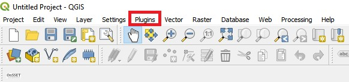
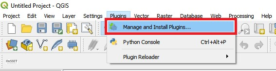
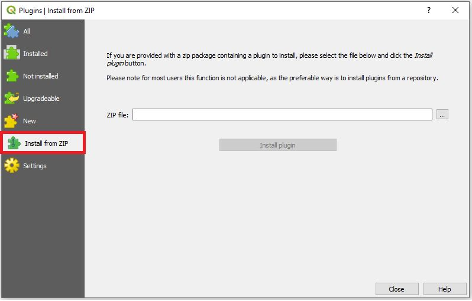
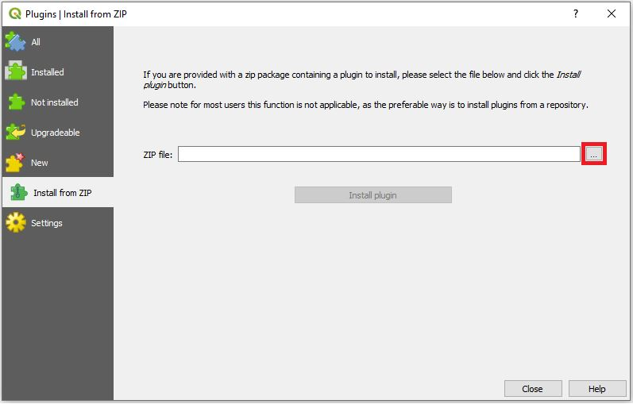
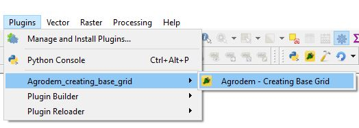

# Agrodem_plugin_creating_basegrid
Used to generate a basegrid in the agrodem process. This is a test repository

## Installation 

### Requirements

- QGIS [3.4](https://qgis.org/en/site/forusers/download.html)
- Python >= 3.6 with the following packages installed:
	- PyQt5
	- shutil
	- qgis
	- datetime

### Adding plugin in QGIS

1.	Download the zipped plugin folder onto your computer.
2.	Open QGIS Desktop (proper version)
3.	Click on the "Plugins" menu

	

4.	Go to "Manage and Install Plugins..."

	

5.	Choose Install from ZIP
 	
	

6.	In the window that opens click on the three dots next to the empty field to navigate to where you saved the zipped plugin folder
	
	

7.	Select it and click "Install plugin"
 	
	

8.	An installation progress bar will appear on top of the screen
	
	

9.	After the plugin is installed it appear under the "Plugins" menu with the name Agrodem - Creating Base Grid. It is now ready to use!
	
	

## Using the plugin

1.	Open the plugin in QGIS

2.	Add necessary input layers

* The admin boundaries layer for the area of interest (polygons) ([GADM](https://gadm.org/))
* FAO agro map

The input FAO agro map should contain the following information:

1. **state** - name of the state
2. **c_code** - country code 
3. **country**
4. **crop** - name of crop
5. **year** - year of data
6. **harv_area_** - harvested area in hectares
7. **yeild** - the yeild, defined as (area of product)/(the production)
8. **product_kg** - the production

3.	Run the plugin

If succesful, the resulting layers will be added in your workspace. Four additional columns will be added to the ones mentioned above (some of the ones above will be renamed, the old names are given in parantheses):

1. **state** - name of the state
2. **c_code** - country code 
3. **country**
4. **crop** - name of crop
5. **year** - year of data
6. **harv_area_ha** - harvested area in hectares (old name: harv_area_) [ha]
7. **yeild** - the yeild, defined as (the production)/(area of product) [kg/ha] 
8. **product_kg** - the production [kg]
9. **state_area_ha** - area of the state [ha]
10. **perimeter** - perimeter of the state [km]
11. **lon** - longitude coordinates (in WGS84 EPSG:4326)
12. **lat** - latitude coordinates (in WGS84 EPSG:4326)

Sample input/output files are available for Mozambique [here](Mozambique%20sample)

## Cautions

* As of October 2019 The plugin can only be run on QGIS 3.4 (latest stable version). Note that newer or older version of QGIS will not work

## Supplementary material

* For any bugs reported please raise an issue on this repository

* For any additional information please contact the [KTH team](http://www.onsset.org/contact--forum.html)