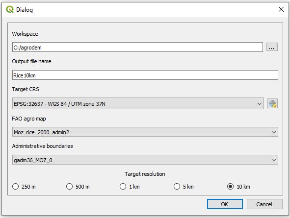

## Agrodem creating base grid plugin

**This plugin was developed by KTH dES to automate the process of generating a base grid layer at the desired target spatial resolution**

## Installation 

### Requirements

- QGIS [3.4](https://qgis.org/en/site/forusers/download.html)
- Python >= 3.6 with the following packages installed:
	- PyQt5
	- shutil
	- qgis
	- datetime

### Adding plugin in QGIS

1.	Download the zipped plugin folder onto your computer.
2.	Open QGIS Desktop (proper version)
3.	Click on the "Plugins" menu

	

4.	Go to "Manage and Install Plugins..."

	

5.	Choose Install from ZIP
 	
	

6.	In the window that opens click on the three dots next to the empty field to navigate to where you saved the zipped plugin folder
	
	

7.	Select it and click "Install plugin"
 	
	

8.	An installation progress bar will appear on top of the screen
	
	

9.	After the plugin is installed it appear under the "Plugins" menu with the name Agrodem - Creating Base Grid. It is now ready to use!
	
	

## Using the plugin

1.	Open the plugin in QGIS


2.	Add necessary input layers

* **Admin boundaries:** Vector polygon indicating administrative boundaries for the AoI
* **Admin level crop layer:** Vector polygon indicating the following characteristics per admin area (in this case level 2):

1. **state** - name of the state
2. **c_code** - country code 
3. **country** - name of the country
4. **crop** - name of modelled crop
5. **year** - year of data
6. **harv_area_** - harvested area in hectares
7. **yeild** - the yeild, defined as (area of product)/(the production)
8. **product_kg** - the production

**Note!** All layers should be in a reference coordinate systems (e.g. WGS 84). Examples are available in the ```Input_data``` folder. 



3.	Run the plugin

If succesful, the ```sample_output_1km.csv``` (5km or 10km) will be added in the designated workspace (```e.g. Output_data```). Four additional columns are now added to the ones mentioned above:

9. **state_area_ha** - area of the state [ha]
10. **perimeter** - perimeter of the state [km]
11. **lon** - longitude coordinates (in WGS84 EPSG:4326)
12. **lat** - latitude coordinates (in WGS84 EPSG:4326)

**Note!** A more elaborate description of the instructions is available on ```Instructions``` sub-folder.

#### Cautions

As of March 2020 The plugin can only be run on QGIS 3.4 (latest stable version). Note that newer or older version of QGIS will not work

#### Supplementary material

For any bugs reported please raise an issue on this repository. For any additional information please contact the [development team](https://agrodem.readthedocs.io/en/latest/Contact.html).
