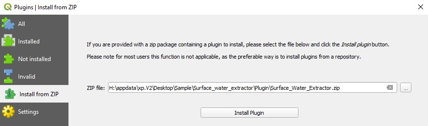
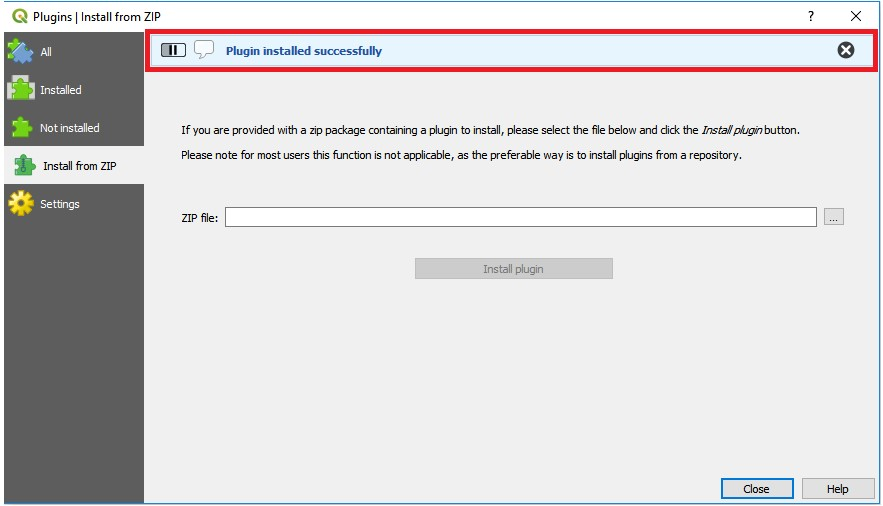
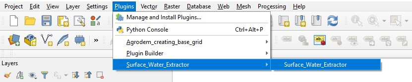
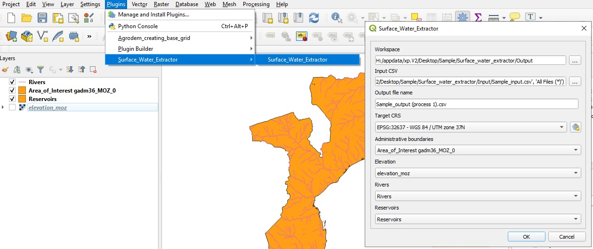
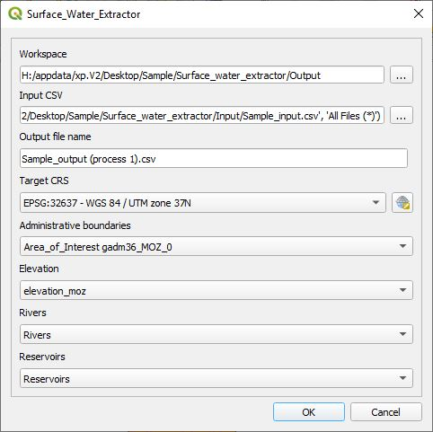

## Surface Water Extractor plugin

**This plugin was developed by KTH dES to automate the process of extracting surface water attributes to vector points of indicative crop distribution data**.

## Installation 

### Requirements

- QGIS [3.4](https://qgis.org/en/site/forusers/download.html)
- Python >= 3.6 with the following packages installed:
	- PyQt5
	- shutil
	- qgis
	- datetime

### Adding plugin in QGIS

1.	Download the zipped plugin folder onto your computer.
2.	Open QGIS Desktop (proper version)
3.	Click on the "Plugins" menu

	

4.	Go to "Manage and Install Plugins..."

	

5.	Choose Install from ZIP
 	
	

6.	In the window that opens click on the three dots next to the empty field to navigate to where you saved the zipped plugin folder
	
	

7.	Select it and click "Install plugin"
 	
	

8.	An installation progress bar will appear on top of the screen
	
	

9.	After the plugin is installed it appear under the "Plugins" menu with the name Agrodem. It is now ready to use!
	
	

## Using the plugin

1.	Open the plugin in QGIS

	

2.	Select the input data

* **Admin boundaries:** Vector polygon indicating administrative boundaries for the AoI
* **River network:** Vector polylines indicating river network over the AoI
* **Reservoirs:** Vector polygons indicating lakes and reservoirs over the AoI
* **Elevation:** Raster layer indicating elevation (in m) over the AoI (e.g. Digital Elevation Map)

**Note!** All layers should be in a reference coordinate systems (e.g. WGS 84). Examples are available in the ```Input_data``` folder. 

**Note!** Altough the river network can include any type of river, it is highly suggested that perennial rivers are used in order to re-assure flow through out the year. In this example, we use river that indicate [Strahler](https://www.mdpi.com/1996-1073/11/11/3100) number > 3.

In addition to the previous layers, the plugin requires the .csv file containing the potential crop locations over the area of interest. There is no need adding the .csv file on QGIS, instead it can be uploaded directly through the plugin's UI. An example is available in the folder as ```sample_input.csv```. The file shall contain the following columns (attributes):

1. **pixel** - Unique id for each pixel of the agricultural area
2. **State** - Name of the dissagregated states 
3. **lon** - Longitude (in EPSG:4326)
4. **lat** - Latitude (in EPSG:4326)
5. **Crop** - Crop in area
6. **Fraction** - The Fraction that is cultivated (if product of the downscaling process)
7. **CropArea** - Area occupied by crop 



**Note!** A more elaborate description of the instructions is available on ```Instructions``` sub-folder.

3.	Run the plugin

If succesful, the ```Sample_output (step 1).csv``` will be added in the designated workspace. Three additional columns are now added to the ones mentioned above:

1. **elevation** - Elevation of closest surface water point [m]
2. **sw_dist** - Distance to closest surface water [km]
3. **sw_suit** - Factor describing suitability of using the closest surface water point [1 = suitable, 9999 = not suitable] 

#### Cautions

As of March 2020 The plugin can only be run on QGIS 3.4 (latest stable version). Note that newer or older version of QGIS will not work

#### Supplementary material

For any bugs reported please raise an issue on this repository. For any additional information please contact the [development team](https://agrodem.readthedocs.io/en/latest/Contact.html).
