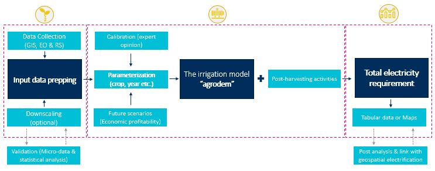

Overview
=================================

This document serves as a data/process descriptor for the code available at the `project github repo <https://github.com/akorkovelos/agrodem>`_. Note that what is included here is far from exhaustive. The aim, instead, it to highlight the main methodological steps as well as to provide a better understanding of the open source code developed to support the modelling exercise. 

.. note::
	Detailed documentation supporting this project is available `here <Add link here when ready>`_.

General info
****************

The methodological approach of this exercise is visually presented below.

   Methodological flow and key modelling elements of this exercise

The core part of the methodology is the **irrigation model**, which was developed to provide an estimate of crops’ water and electricity requirements in a designated area of interest (AoI). The ‘agrodem’ model has been constructed as such to allow for its full customization by the user based on available data, information and other modelling constraints.

**Downscaling** methods have been explored in ordert to overcome data limitations or low resolution crop allocation data. The supporting metholology can help users build up input data in higher resolution using existing tabular data from surveys or statistics. 

To evaluate **future scenarios**, relevant code was developed in order to enable users explore hypothetical alternative scenarios of cropland expansion (“extensification”). This component enables the user to evaluate the impact of expected changes to crops, as well the impact that policy can have on the expansion of crops to new areas over time. Users can interact with the code and create alternative future scenarios that best suit the purpose of the modelling exercise. 

Finally, the model has been augmented to allow for assessment of electricity requirements for **post-harvest activities** (milling, drying, pressing, cold storage etc.). The model was developed as such to allow calibration of input data depending on the type of crop and AoI.

The components described above, create important blocks of work. Each block describes a particular activity and is usually characterized by three elements, namely **input** – **process** – **output**. It also comes with open source code (available in the form of `jupyter notebooks <https://jupyter-notebook-beginner-guide.readthedocs.io/en/latest/what_is_jupyter.html>`_) that provides a clear step-by-step description of how to run embeded processes. Sources are linked where needed (e.g. equations, specific values, assumptions etc.) for transparency and open review.

.. note::
	This is a spatial analysis, therefore some processes require either the installation of spatial libraries in python or the use of a GIS (check `QGIS <https://qgis.org/en/site/>`_) environment. It is recommended that the user uses Python >= 3.5 through `anaconda <https://www.anaconda.com/distribution/>`_ distribution; all required python packages are included in the `full_project_environment <https://github.com/akorkovelos/agrodem/blob/master/full_project_environment.yml>`_ file. QGIS plugins developed and used in this exercise come with separate documentation on installation requirements.

Recommended navigation flow
**************************************
The core of this methodology is the **Irrigation model**. Therefore, it is recommended that a new user starts by opening and navigating through the respective jupyter notebook. It is structured in such way so as to provide a clear step-by-step overview of the modelling process. Sample input/outout files (described above) can be used to test and experiment with the model. 

Once the user develops a better understanding of the model, can shift her attention to input data and processes related to generating new or customized input for the model. Relevant code has been developed - and made available – on github. Note however that although code is self-explanatory and replicable to the extent possible, this part is relatively time consuming, resource intensive and might require debugging in both python and QGIS.

A branch of data preparation is related to **“Downscaling”**. That is, creating high resolution input data for the irrigation model based on coarse data sources. This part is optional; the irrigation model can run with coarse, curently openly available data. However, downscaling can be quite useful in cases where data is scarce. This covers big part of areas this analysis targets at, for example areas in Sub-Saharan Africa. 

Note that cross-validation of the downscaling process with actual data might be necessary. Code has been developed; yet it is context specific. That is, it needs to be customized to the user’s individual validation data and processes.

Finally, once comfortable with the above, the user might want to explore alternative scenarios. This might include changing the model's input parameters and/or assumptions or create alternative **Future Scenarios**. Supporting code allows for scenario development that can be flexibly designed depending on purpose covering physical suitability (e.g. extensification), economic feasibility (e.g. intensification, productivity gains), environmental governance (e.g. protected areas) or climate resilience (e.g. heat or flood resilience); among others. 