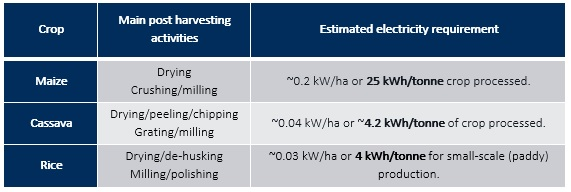

Post-harvesting (& post-analysis) module
====================================================

Overview
****************

In this exercise spatial modelling of post-harvest processes was limited to on-farm primary post-harvest processing. This is because these are most likely to take place in areas without access to the grid. A review of available literature and survey data indicated the following findings:

* Electricity requirements for post-harvesting activities can be classified into two groups; post harvest and **primary** processing (drying, milling, chilling etc.) and **secondary** processing (packaging, bottling etc.). Note that primary processing is more akin to happen close to farms (in rural areas) than secondary processing.

* **Heating and drying** is commonly applied to harvested crops to reduce the moisture content and increase shelf life (e.g. grains, fruits and pulses). The electricity demand is approximately 6 kWh per metric tonne of processed crop.

* **Milling** is another common value chain component across most agricultural products, used to produce flour. Small mills (electric or diesel motors) have a power demand of ~33 kW per tonne of crop milled. Larger (commercial) mills may consume ~15-26 kW per ton ne milled.

* **Pressing** is the process of oil extraction, typically applied to soybean, sunflower, sesame, palm oil and ground nuts. Power demand ranges between 10-23kW per tonne of crop pressed.

* **Cold storage** is amongst the most electricity intensive processes in the agriculture value chain, especially in warm climate countries. Electricity requirements depend a lot on size of cooling facility and target temperature. Small evaporation cooling storage room (20 m2) may require ~0.9 kWh/tonne, while refrigerated cold room (80 m2) ~30-50 kWh/tonne.

* **Packaging** takes place when preparing harvests for transport between the fields and storage facilities, and from storage facilities to retail facilities. In the context of Sub-Saharan Africa, this is mostly done by hand, without significant electricity requirements.

.. note::
   Note that some agricultural products (cassava, meat processing, dairy products, sugarcane etc.) have specific post-harvest processing requirements, thus additional electricity needs. A more elaborate description of those is available in the `project report <https://tbd>`_.

Parameterization & model run
******************************

Modelling electricity demand from post-harvest activities in this project consisted of the following steps:

* **Step 1:** Identifying the post-harvest technologies in use in the specific country. The type of technology used depends on country specific practices and technological resources. The specific technologies should be identified as the electricity demand profile varies according to technology. 

* **Step 2:** Estimating the volume (in terms of tonnes) of agricultural products being generated in the area of interest By identifying the types of crops being produces, this will narrow down the potential post-harvesting processes and their corresponding electricity demand.

* **Step 3:** Applying the technology usage profile to the crop production profile. The final step brings together insight gathered from steps two and three to generate a country specific profile of electricity demand from post-harvest processes. Note that estimating the proportion (in terms of tonnes) of each crop that is processed as supposed to sold directly after harvest is also possible. This proportion can vary by crop and country, depending on the extent to which products are processed or stored in farm.

.. figure::  images/Post_Fig1.jpg
   :align:   center

   Methodological flow of modelling post-harvesting activities

In this exercise, inputs in the modelling of post harvesting activities involved electricity requirements for the different activities identified as shown below.   

   Common post-harvesting activities for the main crops in Mozambique

.. note::
	Modelling post-harvesting activities is implemented through Python script `Result post analysis <https://github.com/akorkovelos/agrodem/blob/master/agrodem_postprocessing/Post_harvesting/Result_post_analysis.ipynb>`_ that was developed as part of an overal post analysis of irrigation model results. 

Output data
****************

The output indicates electricity requirements for post-harvesting activities of the selected crop and AoI. Results are available at the resolution of crop data but can also be aggregated by administrative area as shown below.

.. figure::  images/Post_Fig3.jpg
   :align:   center

   Common post-harvesting activities for the main crops in Mozambique

Special notes
****************

Introducing electricity to post-harvesting activities can increase efficiency and productivity. We have developed an approach, in which electricity requirements for such activities can be spatially identified and quantified. 

However,

* At this stage, production is estimated based on two yield ratios (current and max potential) that do not vary per location. This could be implemented in our modelling approach, if such data become available in the future.

* Many parameters in the modelling exercise require expert judgement to set. That may include, technologies used, common practices, policies etc. That is, model input parameters should be decided with caution and under the consultation of local agriculture/energy experts.

* It is very difficult to decide in which areas post-harvesting activities will take place. Thus, this exercise can only be used for a quick, screening analysis of estimated power requirements for such activities that combined with irrigation requirement can help delineate the spatial condors of electrification for agro-productive uses.

